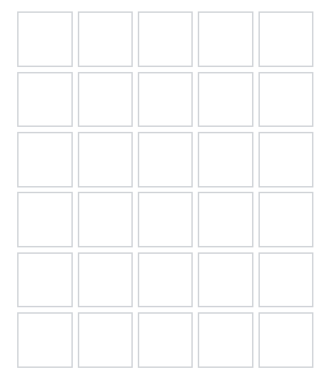

# G06-TPI-1cuatr
### Integrantes: Agustina Fornés, Chiara Mennuti, Javier Santa Cruz y Salvador Tartaglia

Nosotros vamos a desarrollar una aplicación web que contenga una imitación del famoso juego "Wordle" que permita profundizar, divulgar y familiarizar los ODS de la Agenda 2030 a nivel generaL y el ODS Nº13 AcciOn por el Clima de manera particular.  

El formato será similar al juego original de "Wordle" en donde los jugadores tendrán que adivinar una palabra relacionada al tema en X cantidad de intentos. El usuario irá ingresando diferentes palabras y el programa va a indicar si las letras están o en la palabra a adivinar o se encuentra en la misma posición que en la palabra que da fin al programa. 

Las opciones de palabras que van a tener los jugadores para adivinar van a estar en una Base de Datos, lo que va a permitir expandir nuestros conocimientos sobre el tema y las materias involucradas.

Una vez adivinada la palabra, el usuario va a poder visualizar en la aplicaciOn web a qué ODS pertenece la palabra que descubrió y una curiosidad o dato de la misma relacionada al tema. 

A continuación, mostramos un boceto de la interfaz del proyecto.

----------------------------------------------------------------------------------------------------------------------------------------

Jugadores: 1

Nombre: Manuel

Intentos: 6

Tiempo: 00:05:00 minutos

                                                    - INICIAR - 

----------------------------------------------------------------------------------------------------------------------------------------

*Iniciar - Nombre del jugador, cantidad de intentos y lImite de tiempo* 

----------------------------------------------------------------------------------------------------------------------------------------

----------------------------------------------------------------------------------------------------------------------------------------

*Interfaz del juego*

----------------------------------------------------------------------------------------------------------------------------------------

Tiempo: 00:03:00 minutos restantes

Cantidad de intentos: 6

Felicidades, adivinaste la palabra!

### Manuel, ¿Sabías Que...?

La palabra *x* está relacionada con el ODS Nº X, *Nombre del ODS*, ... (Explicación de la relación de la palabra con el ODS). 

----------------------------------------------------------------------------------------------------------------------------------------

*Fin de Partida - Tiempo restante, cantidad de intentos utilizados y explicación de la palabra*

----------------------------------------------------------------------------------------------------------------------------------------

#### Funcionalidad

#### Tareas

#### Responsabilidades

#### Primera Entrega (30/6)

#### Segunda Entrega (7/7)

#### Tercera Entrega (14/7)

